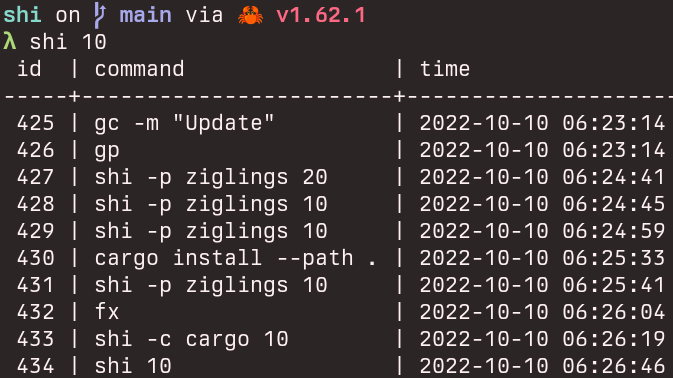
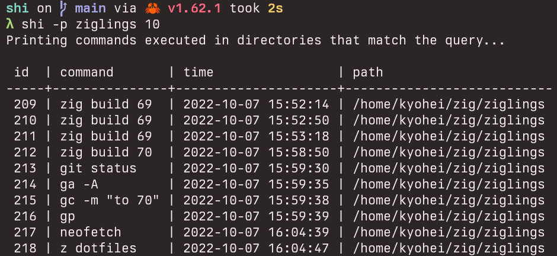
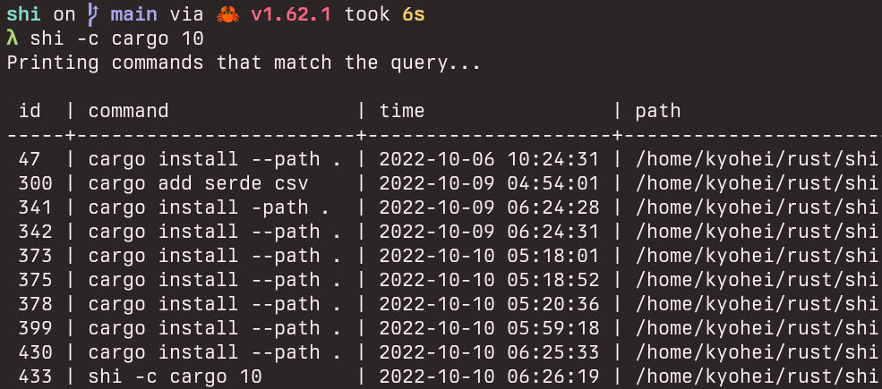

# shi

small history / 史

A tiny program to complement bash history using sqlite





## Installation

```
git clone https://github.com/kyoheiu/shi.git
cd shi
cargo install --path .
```

And add the following lines to the end of `.bashrc` file.

_bash-preexec required. See [https://github.com/rcaloras/bash-preexec](https://github.com/rcaloras/bash-preexec)_

```bash
source ~/.bash-preexec.sh
preexec() { shi --insert "$@"; }
```

## Usage

At the first launch, `shi` creates sqlite database in `~/.shi/.history`.

```
shi [ROWS]                       Print executed commands and time. If no input 50

Options:
  -a, --all                      Print all the history with the directory path where the command was executed
  -i, --insert <COMMAND>         Insert the command to the history
  -d, --delete <ID>              Delete the command that matches the id
  -r, --remove                   Drop the database table, delete all history
  -p, --path <PATH> [ROWS]       Show commands that were executed in directories that match the query
  -c, --command <COMMAND> [ROWS] Show commands that match the query
  -o, --output                   Export all the history to `~/.shi/history.csv`
```
