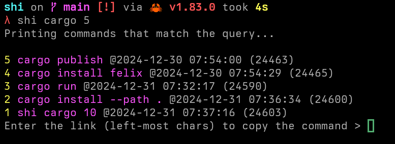

# shi

small history / 史

A tiny program to add time and place to shell history.  
Also enables you to copy a command to the clipboard.



## Installation

```
git clone https://github.com/kyoheiu/shi.git
cd shi
cargo install --path .
```

And add the preexec hook to your shell config file.

For bash:

_bash-preexec required. See [https://github.com/rcaloras/bash-preexec](https://github.com/rcaloras/bash-preexec)_

```bash
source ~/.bash-preexec.sh
preexec() { shi --insert "$@"; }
```

For zsh or fish, you can use preexec hook.

### Option

If you'd like to copy a command to the clipboard, set any clipboard utility such as `xclip` or `wl-copy` as `$SHI_CLIP`.

## Usage

At the first launch, `shi` creates sqlite database in `$XDG_DATA_HOME/shi/.history` (on Linux, in most case it should be `~/.local/share/shi/.history`).

```
shi [ROWS]                       Print executed commands and time. (If no input, 50)

Options:
  -a, --all                      Print all the history with the directory path where the command was executed
  -i, --insert <COMMAND>         Insert the command to the history
  -r, --remove <ID>              Delete the command that matches the id
  -p, --path <PATH> [ROWS]       Show commands that were executed in directories that match the query
  -c, --command <COMMAND> [ROWS] Show commands that match the query
  -o, --output                   Export all the history to `~/.shi/history.csv`
  --drop                         Drop the database table: Delete all history
```
